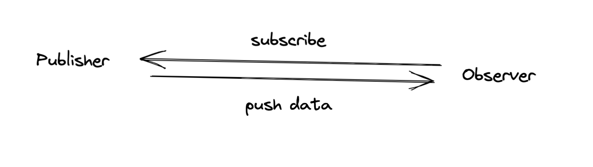

## 什么是命令式编程？
举个例子，我们要实现一个功能，将一个数组中每个元素的数值乘以2，可以实现一个叫double的函数

````
function double(arr){
    const results = [];
    for (let i = 0; i < arr.length; i++){
        results.push(arr[i] * 2)
    }
    return results;
}
````

上面的double函数是典型的命令式编程风格，把计算逻辑完整地描述了一遍。

换一个实现方式，
```function addOne(arr){
    const results = [];
    for (let i = 0; i < arr.length; i++){
        results.push(arr[i] + 1)
    }
    return results;
}```

如果比较这两个函数，你会发现有大量的代码是重复的。

如果把这个函数抽象出来，重新实现一下。
``const double = arr => arr.map(item => item * 2);``
> 这就是声明式编程，简洁的代码。

但上述的函数并没有真的去修改作为参数的数组，而是产生了一个新的数组。

## 纯函数
1. 函数的执行过程完全由输入参数决定，不会受参数之外的任何数据影响
2. 函数不会修改任何外部状态，比如修改全局变量或者传入的参数对象

一个例子，
```
function arrayPush(arr, newVal){
    arr.push(newVal);
    return arr;
}

const originalArray = [1,2,3];
const pushedArray = arrayPush(originalArray, 4);
const doubledPushedArray = double(pushedArray);
// pushedArray 应该是 [1,2,3,4]
// doubledPushedArray 应该是[2,4,6,8]
```
然后，运行结果，实际上doubleOriginalArray的值是： [2,4,6,8]

重新再看一下arrayPush函数，直接调用了传入参数arr的push函数。

将它编程纯函数，
```
function arrayPush(arr, newVal){
    return [...arr, newVal]
}
```


## 响应式编程
比如，在Excel中的sum函数，当你在统计某一列数据时，通过sum函数收集C1-C2所有格子的数值之和，就完成了一次响应式编程。

## 函数响应式编程的优势
1. 数据流抽象了很多现实问题
2. 擅长处理异步操作
3. 把复杂问题分解成简单问题的组合

- 网页DOM事件，可以看作数据流
- 通过WebSocket获得的服务端推送消息也可以看作数据流
- 通过AJAX获得服务器端的数据资源也是数据流

Rx.js 擅长处理异步操作，因为对数据采用的是“推”的处理方式，当一个数据产生时，被推送给处理函数，这个处理函数不关心数据是同步还是异步产生。


## Observable 和 Observer
Observable是“可以被观察的对象”，而Observer就是“观察者”，连接两者的桥梁就是Observable对象的函数subscribe
Rx.js的数据流就是Observable对象，Observable实现了两种设计模式：
- 观察者模式
- 迭代器模式


## 观察者模式
观察者模式将逻辑分为发布者（Publisher）和观察者（Observer），其中发布者只管负责产生事件，它会通知所有注册挂上号的观察者，不关心这些观察者如何处理事件。相对的，观察者可以被注册上某个发布者，只管接收到事件之后的处理。



```
import {Observable} from 'rxjs/Observable';
import of from 'rxjs/Operater';

const source$ = Observable.of(1,2,3);
source$.subscribe(console.log)
```

source$就是一个Observable对象，作为发布者，它产生的事件就是：1、2、3
扮演观察者的是console.log函数

**观察者的好处**
- 如何产生事件，这是发布者的责任，在Rxjs中是Observable对象的工作
- 如何响应事件，这是观察者的责任，在Rxjs中由subscribe的参数决定
- 什么样的发布者关联什么样的观察者，也就是何时调用subscribe


## 迭代器模式
